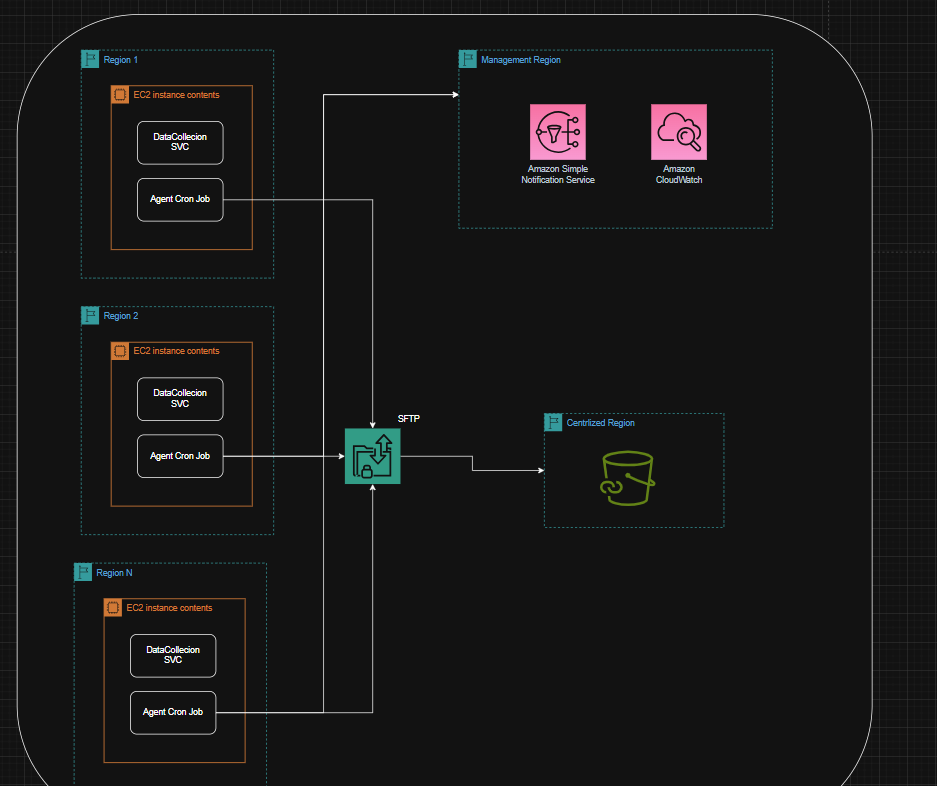

# Data Collection Agent


---

## 📌 Project Overview

Agent based data collection solution for centralized data created on different regions.

### **High-Level Design (HLD)**


### 🛠 Components
1. **AWS CDK Infrastructure (Step 1)**
   - Deploys **CloudWatch Log Group** for monitoring.
   - Deploys **SNS Topic** for failure alerts.

2. **Docker-Compose Local Simulation (Step 2)**
   - **SFTP Server**: Centralized FTP endpoint to receive files.
   - **Three Regional Agents**: Simulate different AWS regions.
   - **AWS Monitoring**: Agents send logs to CloudWatch and errors to SNS.

---

## 📌 Prerequisites

### 🔹 Install Dependencies
Ensure you have:
- **AWS CLI** (configured with `aws configure`)
- **AWS CDK** (`npm install -g aws-cdk`)
- **Docker & Docker Compose** (`docker --version && docker-compose --version`)
- **Python 3.9+** (for AWS CDK)
- **Node.js** (for CDK deployment)

---

# 🚀 Step 1: Deploy AWS Infrastructure using CDK
Note that this will deploy a new SNS Topip + cloudWatcg logs_group in your selected mgt region

### 1️⃣ Install CDK Dependencies
```sh
cd cdk_stack
pip install -r requirements.txt
```

### 2️⃣ Bootstrap CDK (Only Once)
If this is your first time using AWS CDK, run:
```sh
cdk bootstrap
```

### 3️⃣ Deploy the AWS Resources
```sh
cdk deploy
```

### 4️⃣ Get the SNS Topic ARN
After deployment, **copy the SNS ARN** from the output:
```sh
aws sns list-topics
```

### 5️⃣ Set Up AWS Credentials for Docker
Replace values in `.env` with your **AWS_ACCESS_KEY_ID**, **AWS_SECRET_ACCESS_KEY**, and **SNS_TOPIC_ARN**.

```ini
# AWS Credentials
AWS_ACCESS_KEY_ID=your-aws-access-key
AWS_SECRET_ACCESS_KEY=your-aws-secret-key
AWS_REGION=us-west-1

# SNS Topic ARN (get the ARN after the CDK dEPLOYMENT is Done)
SNS_TOPIC_ARN=arn:aws:sns:us-west-1:123456789012:csv_agent_alerts
```

---

# 🚀 Step 2: Run Docker-Based Simulation

### 1️⃣ Build and Run Containers
```sh
docker-compose up --build
```

### 2️⃣ Verify Running Containers
```sh
docker ps
```
You should see:
```
CONTAINER ID   IMAGE         COMMAND             STATUS          NAMES
xxxxxx         agent         "python agent.py"   Up X minutes   agent_region_1
xxxxxx         agent         "python agent.py"   Up X minutes   agent_region_2
xxxxxx         agent         "python agent.py"   Up X minutes   agent_region_3
xxxxxx         sftp          "/entrypoint.sh"    Up X minutes   sftp_server
```

### 3️⃣ Simulating File Creation (Optional)
You can manually **add a file** to one of the regional agent volumes:
```sh
docker exec -it agent_region_1 sh -c "echo 'sample data' > /mnt/recordings/$(date +%F)_data.csv"
```
This will be **automatically processed and uploaded** to the **SFTP server**.

---

# 🚀 Step 3: Verify Uploads & Monitoring

### 1️⃣ Check Uploaded Files on SFTP
```sh
docker exec -it sftp_server ls -lh /home/ftpuser/uploads/
```
Expected output:
```
-rw-r--r-- 1 ftpuser ftpuser 10MB  YYYY-MM-DD_data.csv.gz
```

### 2️⃣ Check CloudWatch Logs
```sh
aws logs describe-log-groups --log-group-name-prefix CSV_Agent_Logs
aws logs get-log-events --log-group-name CSV_Agent_Logs --log-stream-name us-east-1
```

### 3️⃣ Check SNS Alerts
If an error occurs, **AWS SNS** will trigger an email notification.  
To **subscribe to SNS**, run:
```sh
aws sns subscribe --topic-arn arn:aws:sns:us-west-1:123456789012:csv_agent_alerts --protocol email --notification-endpoint your-email@example.com
```
Confirm the subscription via **email**.

---

# 🚀 Step 4: Cleanup

To **remove all AWS resources**, run:
```sh
cdk destroy
```

To **stop Docker services**, run:
```sh
docker-compose down
```

---

## 📌 Summary
✅ **Step 1: Deploy AWS CDK for monitoring**  
✅ **Step 2: Run Docker-Compose to simulate SFTP & Agents**  
✅ **Step 3: Verify uploads & AWS monitoring**  
✅ **Step 4: Cleanup when done**  
